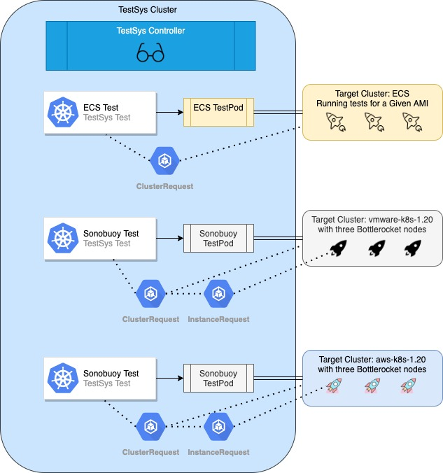
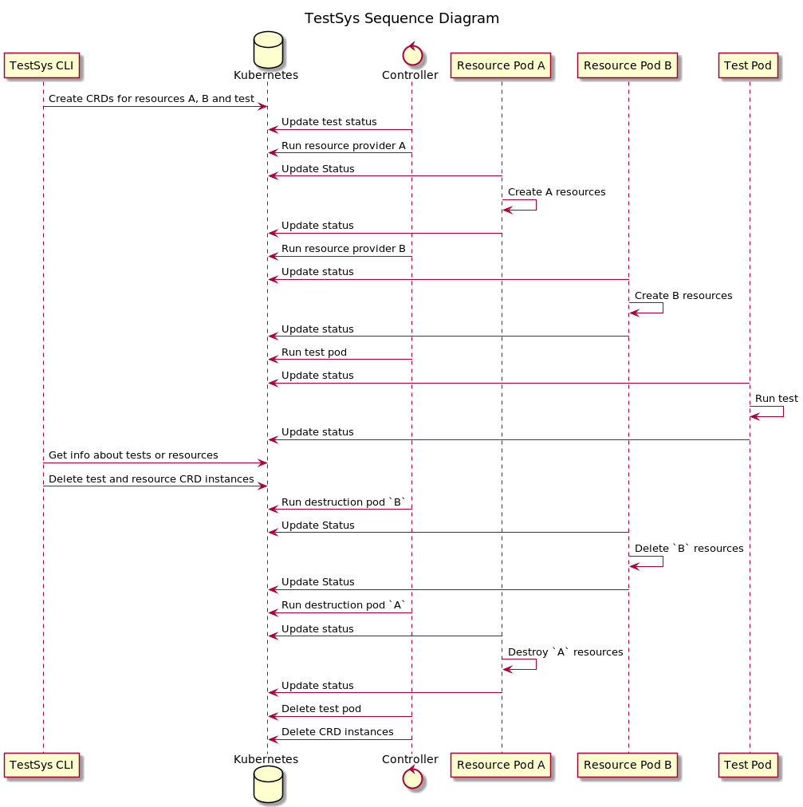

# Testsys for Bottlerocket

## Introduction

This document describes the design of *TestSys*, a system for abstracting over Bottlerocket testing modalities using containers orchestrated by Kubernetes.

*TestSys* is designed to be used in the following scenarios:

* By developers in their local workflow.
* By GitHub CI (eventually, with further design).
* During release processes.

### Goals

* TestSys should be easy to set up and use for at least some subset of integration tests.
* TestSys should be usable without using AWS.
  (For example Kind + vSphere, or Kind + qemu)

### Non-Goals

* TestSys is not trying to compete with or replace other testing systems, it is specific to Bottlerocket.
* TestSys does not decide what tests to run based on variants, filters or tags.
  The caller tells it what to run.

## General Architecture

TestSys consists of a command-line program and Kubernetes objects that drive Bottlerocket tests.
Different testing modalities are abstracted-over by packaging them in Kubernetes pods.
For example, a pod can contain the Sonobuoy binary, and everything else needed to run Sonobuoy tests.

The Kubernetes cluster that hosts TestSys objects is *not* the cluster that is being targeted for testing.
Instead, the Kubernetes or ECS cluster under test is an external resource to TestSys.
The cluster under test can be a long-lived cluster, or it can be a transient (e.g. local) cluster.

The API between the TestSys CLI and tests is built entirely on the Kubernetes API.
Thus the Kubernetes API server is the only server with which the TestSys CLI communicates.

Kubernetes Custom Resource Definitions (CRDs) are used in the TestSys cluster to manage:

* *Test*: The state of a test run.
* *ResourceProvider*: A provider of external resources.

A custom TestSys [controller] manages TestSys CRD object and their associated pods.
Output needed by the TestSys CLI is provided in CRD [status] fields.

[controller]: https://kubernetes.io/docs/concepts/architecture/controller/
[status]: https://kubernetes.io/docs/tasks/extend-kubernetes/custom-resources/custom-resource-definitions/#status-subresource

## Definitions

**TestSys**:

A command line interface that interacts with a Kubernetes cluster to drive Bottlerocket testing.

**TestSys Cluster**:

The cluster that the TestSys CLI communicates with.
This is where TestSys CRDs, the TestSys Controller, and TestPods run.
The TestSys cluster can be local (e.g. using Kind or Minikube), or it can be in the cloud.

**TestSys Controller**:

A Kubernetes controller responsible for launching pods and managing TestSys CRD objects.
Built with [kube-derive] and [kube-runtime].

[kube-derive]: https://docs.rs/kube-derive/latest/kube_derive/
[kube-runtime]: https://docs.rs/kube-runtime/latest/kube_runtime/

**TestSys Test**

A CRD representing a test that we want to run.
The TestSys CLI creates an instance of a TestSys Test CRD to indicate its desire to run a test.
The status of the test is available in the status field of the CRD instance.

**TestPod**:

A Kubernetes pod responsible for test initiation, monitoring and reporting.
For example, if we wrapped the existing Sonobuoy test scripts into a pod, that would be a *TestPod*. The image URI for a TestPod is included in the TestSys Test CRD.

**TestAgent**:

The main process in a TestPod.
The TestAgent is responsible for updating the TestSys Test CRD object with test status and outcome.

**TestAgent Library**:

A Rust library (using [kube-rs]) that is provided for writing TestAgents.
Necessary TestAgent actions are represented by traits and passed to a main Service struct.
The author of a TestAgent can focus on the details of their testing modality and implement the necessary traits as a wrapper.

[kube-rs]: https://github.com/clux/kube-rs

**ResourceProvider**:

A TestSys Test can use a ResourceProvider to provide an external resource for the test.
The ResourceProvider CRD includes the URI for an image that can create and destroy a certain type of resource.

* **InstanceProvider**: A ResourceProvider responsible for launching and cleaning up Bottlerocket hosts.
* **ClusterProvider**: A ResourceProvider responsible for providing a cluster.
    * **Static ClusterProvider**: A ClusterProvider that simply references a long-lived cluster by providing configs.
    * **Dynamic ClusterProvider**: A ClusterProvider that actually creates and destroys clusters.

**ResourcePod:**

The pod that the TestSys controller runs, using information in a ResourceProvider CRD instance.
The ResourcePod can create and destroy resources such as EC2 or VMware instances.

**ResourceAgent:**

The main process in a ResourcePod.

**ResourceAgent Library:**

A Rust library that is provided for writing ResourceAgents.
Necessary ResourceAgent actions are represented by traits and passed to a main Service struct.
The author of a ResourceAgent can focus on the details of their resource type and implement the necessary traits as a wrapper.

**ResourceRequest**:

A ResourceRequest is a part of the TestSys Test CRD schema.
It represents an external resource needed by the test. For example, if 3 EC2 instances are needed, a ResourceRequest is included in the Test CRD instance.
The ResourceRequest references the name of a ResourceProvider CRD instance that can provide the resources.
Status fields in the TestSys Test CRD are used to indicate status and details about the resources.

## Architecture Diagram

At the top we have the TestSys controller, which watches for TestSys Test CRD instance, runs pods, updates the CRD etc.

On the right, we have three test scenarios.
In each of these scenarios, a TestSys Test instance is created by the TestSys CLI.
The controller runs pods to fulfill the ClusterRequests, InstanceRequests and execute the test. The test execution environments are external to the TestSys test cluster.

## External Resources

To maximize its utility, TestSys offers a mechanism for creating and cleaning up resources that are needed for a test.
A long-lived instance of a ResourceProvider CRD can be added to the TestSys cluster.
The ResourceProvider represents a container that can be created on demand to create and destroy resources.

The most popular uses are:

* Creating a cluster.
* Launching Bottlerocket nodes into a cluster.

A TestSys Test can specify resources it needs and the ResourceProvider that provides them.
When the TestSys Controller encounters these requirements in the TestSys Test spec, it creates a pod as specified by the named ResourceProvider and waits for the ResourceProvider to create the resources. 
The ResourceAgent will call Kubernetes to get the ResourceRequest information using the ResourceAgent Library.

The ResourceProvider pod creates the resources and updates the TestSys Test CRD instance with status and details of the created resources.
The controller then sees that the resources are ready and proceeds to the next resource requirement, or on to the test run.

At the end of a test run, the controller runs the resource provider pods again.
This time it requests destruction of the resources.
The ResourceProvider pod updates the Test CRD instance’s ResourceRequest indicating that the resources have been destroyed.

If the ResourceProvider that was used for a ResourceRequest is no longer present in the cluster, the TestSys CLI will provide a warning or error about these dangling resources.
If TestSys Test owned resources cannot be destroyed for any reason the TestSys Test lifecycle will not be complete and the TestSys Test CRD instance will not be deleted.

## User Experience

We want TestSys to be easy to use so we provide everything you need for the most common scenarios.

* Running a local TestSys cluster and running tests in AWS.
* Running an EKS TestSys cluster and running tests in AWS.
* Running a local TestSys cluster and running tests in a vSphere Center.

For these common scenarios the TestSys CLI can install TestSys and ResourceProviders into the desired cluster with minimal fuss.
We provide the containers, pod specs and instantiate CRD instances.

## API

You can also think of the interaction between TestSys and a TestPod or ResourcePod as a form of interface.
TestSys will always mount certain volumes to communicate request information via the downward API.
Secrets will be mounted in a predictable manner.
Dedicated [status] fields of the CRD are used to communicate necessary information from the agents back to the controller.
In this way the TestSys CRD and execution engine define a sort of OO interface that can be implemented by any testing modality.
The TestAgent and ResourceAgent libraries will hide these details from the implementer and ensure that the TestSys API is being used correctly.

[status]: https://kubernetes.io/docs/tasks/extend-kubernetes/custom-resources/custom-resource-definitions/#status-subresource

In Kubernetes the spec and status fields of a CRD are specified with an OpenAPIv3 [schema].
The Kubernetes server validates requests based on the schema provided.
We want to keep TestSys open to new types of providers and tests.
Different providers and tests will have different configuration needs.
Our CRD definitions include a section for open content using an OpenAPI `type: object`, `additionalProperties: true` in the schema.
We call these open-content sections `configuration`.

[schema]: https://kubernetes.io/docs/tasks/extend-kubernetes/custom-resources/custom-resource-definitions/#specifying-a-structural-schema

A Rust type which must implement Serialize and Deserialize will be created by the implementer of TestAgent and ResourceAgent programs.
This will be provided as a type parameter to the agent library so that, from the standpoint of the implementor, the configuration data is strongly typed.

This allows the TestSys controller to remain agnostic about configuration schemas that differ for different test and resource types.
This information goes in `configuration` and is interpreted by the target pod.

## Sequence Diagram

The following diagram takes us through the sequence of events for a TestSys Test run with two required resources, named A and B.
You may need to open the image somewhere for zooming and scrolling.

