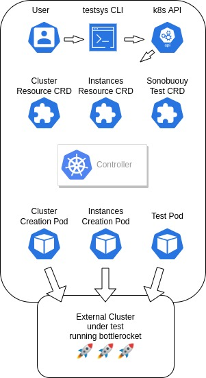

# Testsys for Bottlerocket

## Introduction

This document describes the design of *TestSys*, a system for abstracting over Bottlerocket testing modalities using containers orchestrated by Kubernetes.

*TestSys* is designed to be used in the following scenarios:

* During Bottlerocket release processes.
* By developers in their local workflow.
* By GitHub CI (eventually, with further design).

### Goals

* TestSys should be easy to set up and use for at least some subset of integration tests.
* TestSys should be usable without using AWS.
  (For example Kind + vSphere, or Kind + qemu)

### Non-Goals

* TestSys is not trying to compete with or replace other testing systems, it is specific to Bottlerocket.
* TestSys does not decide what tests to run based on variants, filters or tags.
  The caller tells it what to run.

## General Architecture

TestSys consists of a command-line program (`testsys`) and Kubernetes objects that drive Bottlerocket tests.
Different testing modalities are abstracted-over by packaging them in Kubernetes pods.
For example, a pod can contain the Sonobuoy binary, and everything else needed to run Sonobuoy tests.

The Kubernetes cluster that hosts TestSys objects is *not* the cluster that is being targeted for testing.
Instead, the Kubernetes or ECS cluster under test is an external resource to TestSys.
The cluster under test can be a long-lived cluster, or it can be created specifically for a test.

The API between the TestSys CLI and tests is built entirely on the Kubernetes API.
Thus, the Kubernetes API server is the only server with which the TestSys CLI communicates.

Kubernetes Custom Resource Definitions (CRDs) are used in the TestSys cluster to manage:

* *Test*: Represents a test agent, the state of a test and the results of a test.
* *Resource*: Represents a resource agent that can create and destroy some external resource.

The TestSys [controller] manages TestSys CRD objects and their associated pods.
Resource creation/destruction and test outcomes are provided in CRD [status] fields.

[controller]: https://kubernetes.io/docs/concepts/architecture/controller/
[status]: https://kubernetes.io/docs/tasks/extend-kubernetes/custom-resources/custom-resource-definitions/#status-subresource

## Definitions

**TestSys**:

A command line interface that interacts with a Kubernetes cluster to drive Bottlerocket testing.

**TestSys Cluster**:

The cluster that the TestSys CLI communicates with.
This is where TestSys CRDs, the TestSys Controller, and TestPods run.
The TestSys cluster can be local (e.g. using Kind or Minikube), or it can be in the cloud.

**TestSys Controller**:

A Kubernetes controller responsible for launching pods and managing TestSys CRD objects.
Built with [kube-derive] and [kube-runtime].

[kube-derive]: https://docs.rs/kube-derive/latest/kube_derive/
[kube-runtime]: https://docs.rs/kube-runtime/latest/kube_runtime/

**TestSys Test**

A CRD representing a test that we want to run.
The TestSys CLI creates an instance of a TestSys Test CRD to indicate its desire to run a test.
The status of the test is available in the status field of the CRD instance.

**TestAgent**:

A program that runs a test and reports its outcome by updating the TestSys Test CRD object's status fields.
The test agent is packaged into a container image and the controller runs it in a pod as a Kubernetes `Job`.
For example, we have created a [test agent which uses Sonobuoy] to test the Kubernetes variants of Bottlerocket.

[test agent which uses Sonobuoy]: https://github.com/bottlerocket-os/bottlerocket-test-system/tree/develop/bottlerocket-agents/src/bin/sonobuoy-test-agent

Test agents can also be created using [bash scripts](../agent/test-agent-cli/examples/example_test_agent_cli/example-test.sh).

**[TestAgent Library]**:

A Rust library (using [kube-rs]) that is provided for writing TestAgents.
In order to create a test agent, you implement the `Runner` trait and pass it to an `Agent` struct.
The author of a TestAgent can focus on the details of their testing modality and let the library take care of communications.

[TestAgent Library]: https://github.com/bottlerocket-os/bottlerocket-test-system/tree/develop/agent/test-agent
[kube-rs]: https://github.com/clux/kube-rs

**ResourceAgent:**

A ResourceAgent can create and destroy external resource (such as Kubernetes clusters or compute instances) that are needed for a test.
The ResourceAgent program is packaged into a container image and is represented by a Resource CRD object.
A test can then depend on the existence of a resource and the controller will ensure the resource agent runs before the test is run.
The resource agent is also responsible for destroying a resource after a test runs.

For example, we have created a [resource agent that creates and destroys EKS clusters] using eksctl.

[resource agent that creates and destroys EKS clusters]: https://github.com/bottlerocket-os/bottlerocket-test-system/tree/develop/bottlerocket-agents/src/bin/eks-resource-agent

**[ResourceAgent Library]**:

A Rust library that is provided for writing ResourceAgents.
In order to create a resource agent, you implement the `Create` and `Destroy` traits and pass them to an `Agent` struct.

[ResourceAgent Library]: https://github.com/bottlerocket-os/bottlerocket-test-system/tree/develop/agent/resource-agent

**Resource**:

A Resource is a CRD object representing an external resource (such as a cluster or compute instance).
A test can declare that it depends on a resource so that the controller will ensure the resource exists before running the test.
The resource agent writes to the status fields of the resource object to indicate status and metadata about the created resource.

## Architecture Diagram

The architecture diagram shows a user using the `testsys` CLI to create three CRD instances.

* Cluster Resource CRD represents an external Kubernetes cluster that needs to be created for testing.
* Instances Resource CRD represents Bottlerocket instances that will run as nodes in the external cluster.
* Sonobuoy Test CRD represents the desired test that will run agains the external cluster and nodes.

The controller sees these CRD instances and:

* Creates a cluster.
* Launches Bottlerocket instances as the nodes in the cluster.
* Runs Sonobuoy testing in the external cluster.

## Resources and Test Dependencies

Resources may need to be created in a certain order and tests may depend on other tests.
For example, you may want to:

* create a cluster, `my-cluster`
* launch instances as nodes for the cluster, `my-instances`
* run `test-a`
* and upon successful completion of `test-a`, run `test-b`.

To do this we can specify in the `my-instances` resource CRD that it depends on `my-cluster`.
We can specify that `test-a` depends on resources `my-instances` and `my-cluster`.
We can specify that `test-b` depends on `test-a` as well as resources `my-instances` and `my-cluster`.

Furthermore, you may need some information from a resource in order to create another resource.
For example, we may need to know a subnet ID from `my-instances` in order to create `my-cluster`.
A rudimentary templating language is available so that you can specify in `my-instance`'s configuration that the subnet id it needs is `${my-cluster.subnet-id}`.

## User Experience

We want TestSys to be easy to use, so we provide for the most common scenarios with the `testsys` CLI.
We aim to make the following scenarios possible in the fewest number of steps practical.

* Running a local TestSys cluster and running tests in AWS.
* Running an EKS TestSys cluster and running tests in AWS.
* Running a local TestSys cluster and running tests in a vSphere environment.

For these common scenarios the TestSys CLI can install the controller and CRDs into a cluster and create the CRD instances for running the tests.

## API

You can think of the interaction between TestSys and a test or resource pod as a form of interface.
The controller will inject certain data as files or environment variables and the agent will get additional data from the CRD via a client.
Secrets will be mounted in a predictable manner.
Dedicated [status] fields of the CRD are used to communicate necessary information from the agents back to the controller.
In this way the TestSys CRD and execution engine defines an interface that can be implemented by any testing modality.
The TestAgent and ResourceAgent libraries will hide these details from the implementer and ensure that the TestSys API is being used correctly.

In Kubernetes the spec and status fields of a CRD are specified with an OpenAPIv3 [schema].
The Kubernetes server validates requests based on the schema provided.
We want to keep TestSys open to new types of providers and tests.
Different providers and tests will have different configuration needs.
Our CRD definitions include a section for open content using an OpenAPI `type: object`, `additionalProperties: true` in the schema.
We call these open-content sections *configuration*.

[schema]: https://kubernetes.io/docs/tasks/extend-kubernetes/custom-resources/custom-resource-definitions/#specifying-a-structural-schema

A Rust type which must implement Serialize and Deserialize will be created by the implementer of TestAgent and ResourceAgent programs.
This will be provided as a type parameter to the agent library so that, from the standpoint of the implementor, the configuration data is strongly typed.

This allows the TestSys controller to remain agnostic about configuration schemas that differ for different test and resource types.
This information goes in `configuration` and is interpreted by the target pod.

## Sequence Diagram

The following diagram takes us through the sequence of events for a TestSys Test run with two resources, named A and B.

